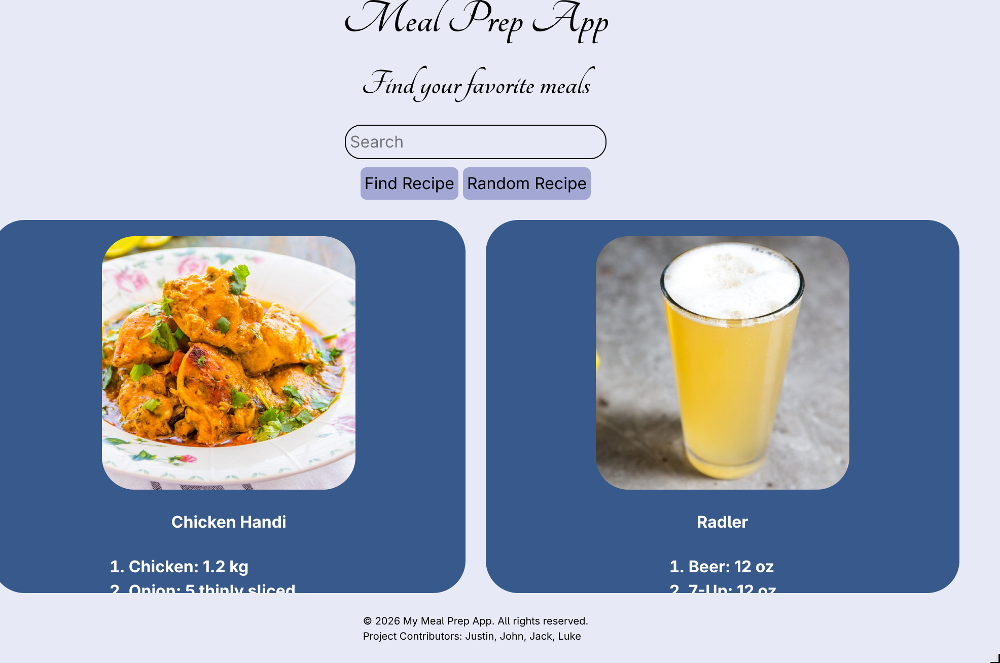
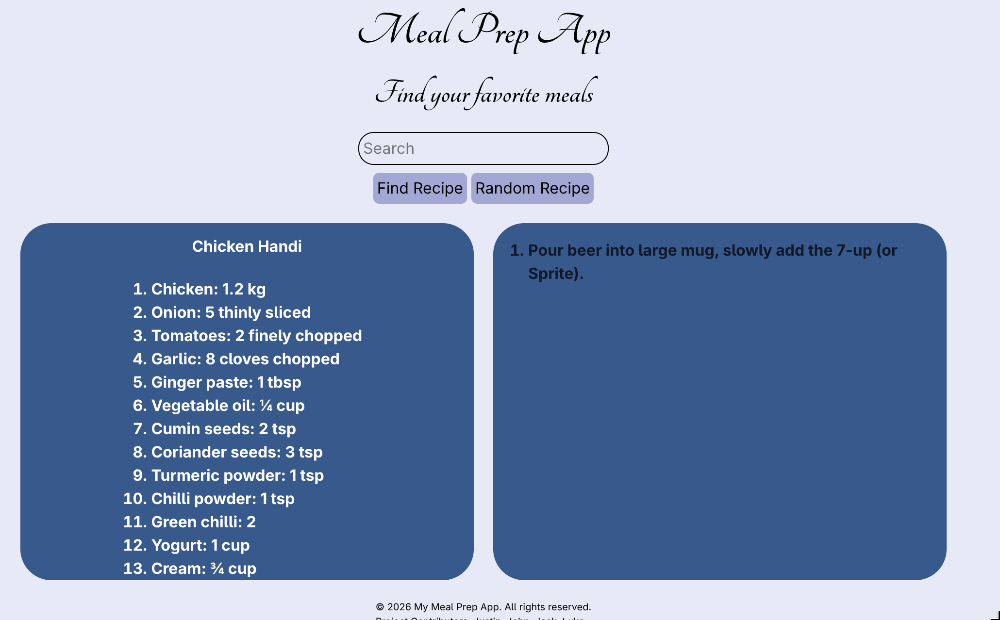
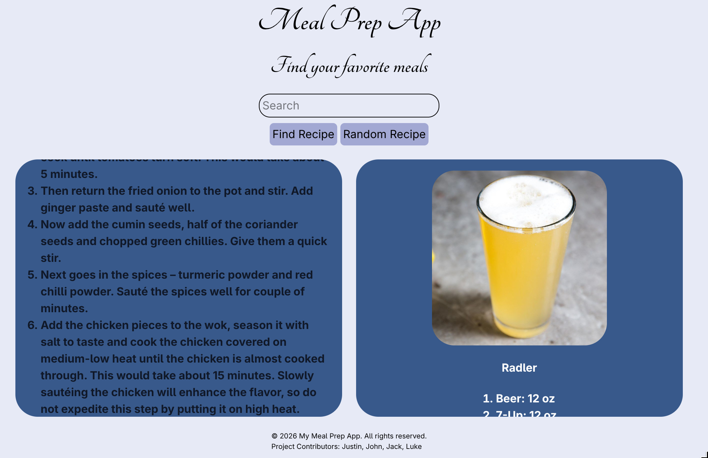
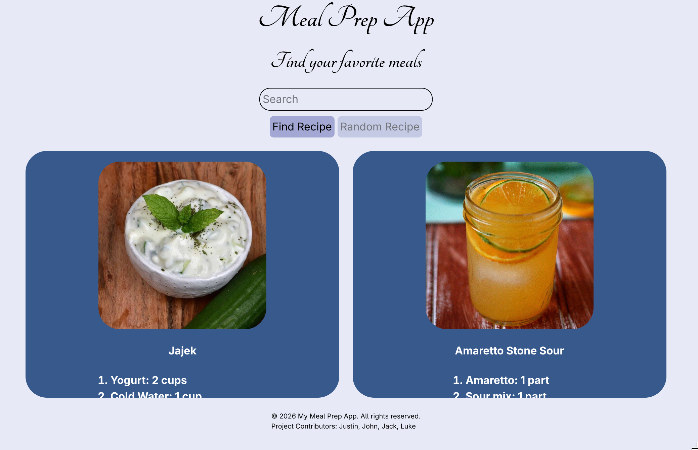

# Meal-Prep-App

## Description

This app allows the lookup of meals and allows the user to also get nutrition values. The user simply types the meal they want or they can get a random meal by pressing the random meal button.

## User Story

- The user can click in a search input and search for a meal
- The user can also click a button to search for a random meal
- The user gets cards back in response for all the meals they searched up or got randomly
- The user can click in each card and reveal nutrition facts

## Technologies used

- HTML
- TailWindCSS
- Javascript
- Apis
    - TheMealDB
    - TheCockTailDB

## ScreenShots

Initial Screen

Search for a recipe

Instructions Shown

Ingredients shown

Random Recipe use

## Website Link

https://cinnabonmon.github.io/Meal-Prep-App/

## Contributors

### Justin Collins

Github: [Cinnabonmon1](https://github.com/Cinnabonmon)
LinkedIN: [Justin Collins](www.linkedin.com/in/justin-collins-482bab361)

### John

Github: [jzy2101](https://github.com/jzy2101)

### Luke

Github: [Lukos1107](https://github.com/Lukos1107)

### Jack
